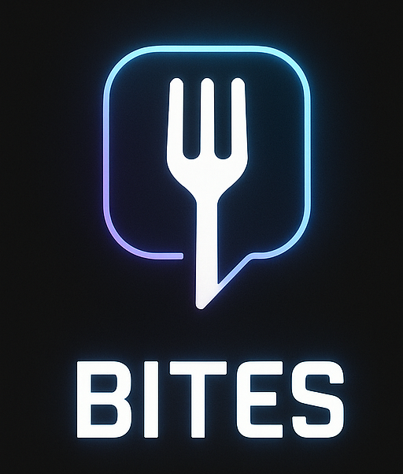

# Bites 



**Bites** es una plataforma web donde los usuarios pueden descubrir, reseñar y compartir restaurantes. Además, permite crear publicaciones tipo Instagram con fotos, etiquetar restaurantes, seguir a otros usuarios y más.

---

## Tecnologías utilizadas

- **Frontend**: React, Vite, Tailwind CSS, React Router DOM, SweetAlert2, Swiper.js
- **Backend**: Python, Flask, SQLAlchemy, Marshmallow, Flask-JWT-Extended
- **Base de datos**: SQLite (modo desarrollo)
- **Servidor local**: XAMPP (Apache) para entorno local

---

## Requisitos previos

- Python 3.10+
- Node.js y npm
- XAMPP o equivalente (si usas Apache en local)
- Git (opcional pero recomendado)

---

## Instrucciones de instalación y ejecución

### 🔹 Backend (Flask)

1. Clona el repositorio o descarga el proyecto.
2. Ve al directorio del backend.
3. Crea y activa un entorno virtual:

```bash
python -m venv venv
# En Windows:
venv\Scripts\activate
# En Unix/macOS:
source venv/bin/activate
```

4. Instala las dependencias:

```bash
pip install -r requirements.txt
```

5. Crea el archivo `.env` en el backend:

```
FLASK_APP=app.py
FLASK_ENV=development
SECRET_KEY=tu_clave_secreta
JWT_SECRET_KEY=tu_clave_jwt
```
6. Ejecuta el backend:

```bash
python app.py
```
o 

```bash
flask run
```


> Esto abrirá el backend en `http://localhost:5000`

---

### 🔹 Frontend (React + Vite)

1. Ve al directorio `frontend`
2. Instala las dependencias:

```bash
npm install
```

3. Crea un archivo `.env`:

```
VITE_API_URL=http://localhost:5000
```

4. Inicia el servidor de desarrollo:

```bash
npm run dev
```

> Esto abrirá la app en `http://localhost:5173`

---

## Funcionalidades principales

- Registro e inicio de sesión con JWT
- Crear, editar y eliminar restaurantes (solo usuarios creadores)
- Añadir reseñas con puntuación
- Comentarios con respuestas y likes
- Sistema de publicaciones con imágenes y vídeos (estilo Instagram)
- Etiquetado de restaurantes en publicaciones (incluso si no existen aún)
- Buscador de usuarios y perfiles públicos
- Panel de configuración del usuario
- Eliminación de cuenta con opción de conservar restaurantes
- Sistema de roles (usuario/admin)
- Panel de administración (WIP)
- Filtros y ordenamiento de restaurantes
- Interfaz responsive

---

## Por hacer / Mejoras futuras

- Implementar sistema de seguidores / notificaciones
- Publicaciones premium (tipo OnlyFans)
- Mejorar accesibilidad y PWA
- Versión móvil optimizada
- Subida de imágenes en producción (ej: Cloudinary)
- Internacionalización (i18n)
- Tests unitarios y end-to-end

---

## Autor

Proyecto desarrollado por **Aarón León Fleitas** — [IES El Rincón]

Este proyecto forma parte del módulo PRW del ciclo de Desarrollo de Aplicaciones Web (DAW).

---

## Estructura general del proyecto

```
bites/
├── backend/
│   ├── app.py
│   ├── models/
│   ├── routes/
│   ├── static/
│   └── ...
├── frontend/
│   ├── src/
│   ├── components/
│   └── ...
└── README.md
```

---

## Licencia

Proyecto académico — Todos los derechos reservados.
